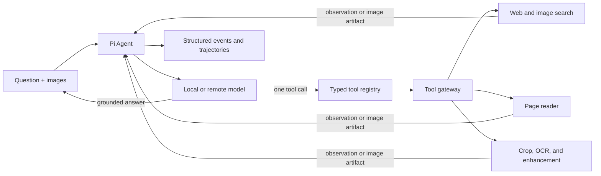
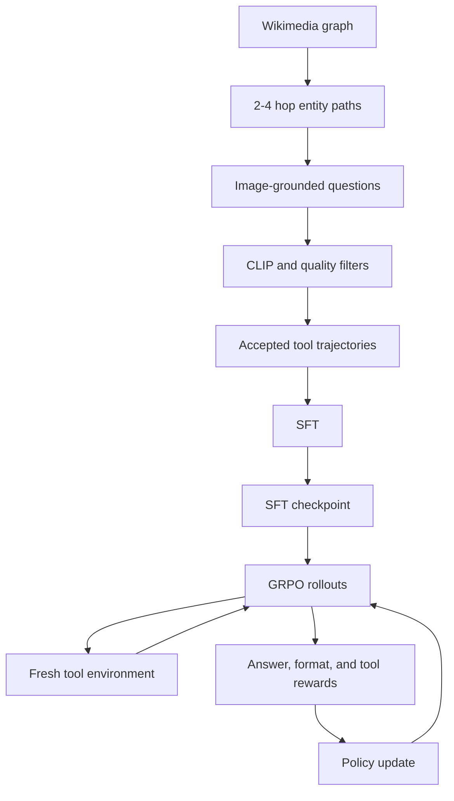

# Sightline Agent

Sightline is an evidence-grounded multimodal search agent for questions that
begin with an image but require external retrieval, visual inspection, and
multi-step reasoning to answer reliably.

The project includes an online agent runtime, search and vision tools, a
grounded data-generation pipeline, supervised fine-tuning, tool-interactive
GRPO, and reusable Agent Skills.

## Features

- Pi-based runtime with typed, sequential tool calls.
- Support for local multimodal models and configurable remote providers.
- Web search, page reading, image search, crop, OCR, sharpening, super
  resolution, and perspective correction.
- Multi-hop data generation with CLIP filtering and strict quality gates.
- Shared message and tool contracts across inference, SFT, and GRPO.
- Deterministic answer rewards with explicit tool and execution signals.

## Architecture



The runtime manages conversation state and the model/tool loop. External
retrieval and image processing remain behind the tool gateway, so credentials
are not exposed to the model.

## Training pipeline



## Repository layout

| Path | Purpose |
| --- | --- |
| [`agent/`](agent/) | Agent runtime, provider adapters, tools, and gateway |
| [`data/`](data/) | Data generation, validation, and conversion |
| [`sft/`](sft/) | Supervised trajectory training |
| [`rl/`](rl/) | Tool-interactive GRPO |
| [`.pi/skills/`](.pi/skills/) | Search and full-agent skills |

## Installation

Requirements: Node.js 22+, Conda, and Python 3.10+.

```bash
git clone https://github.com/Cliff-fen/sightline-agent.git
cd sightline-agent

conda create -n sightline-gen python=3.10 -y
conda activate sightline-gen
python -m pip install -r requirements.txt

npm --prefix agent install
npm --prefix agent run build
```

## Run the agent

Configure the model and optional retrieval services through environment
variables. [`agent/.env.example`](agent/.env.example) documents the supported
settings with empty credential fields. Keep populated values outside Git.

Start the tool gateway from the repository root:

```bash
conda activate sightline-gen
python agent/services/tool_gateway.py
```

Start the agent runtime:

```bash
npm --prefix agent start
```

The public HTTP surface is intentionally small:

| Method | Path | Purpose |
| --- | --- | --- |
| `GET` | `/health` | Runtime configuration and registered tools |
| `POST` | `/v1/runs` | Execute one multimodal investigation |

Example request:

```bash
curl http://127.0.0.1:8080/v1/runs \
  -H 'content-type: application/json' \
  -d '{"input":[
    {"type":"text","text":"Identify the venue and support the answer with evidence."},
    {"type":"image","image":{"kind":"image","id":"input-1","uri":"https://example.com/photo.jpg"}}
  ]}'
```

## Generate data

The generator samples multi-hop paths, selects representative images, rewrites
entity names into non-leaking clues, rejects predictable questions, and keeps
only trajectories that pass answer and process review.

```bash
python -m data.generation.pipeline \
  --output-dir data/generated/run-001 \
  --samples 10 \
  --generate-trajectories \
  --agent-url http://127.0.0.1:8080
```

Each run produces accepted records, complete rejection audits, and SFT/GRPO
JSONL files. See [`data/README.md`](data/README.md) for the data contract and
quality gates.

## Validate the pipeline

Run the preflight before training. The probe should be a real image known to
produce reverse-image matches; generated test patterns are unsuitable for that
check.

```bash
python scripts/preflight.py \
  --probe-image /path/to/searchable-image.jpg \
  --rl data/processed/rl/train.jsonl \
  --decode-images
```

To validate a completed smoke run as well, add
`--training-log outputs/grpo-smoke/train.log`. The command fails if a tool
returns invalid output, an image cannot be decoded, no tool is used during the
rollout, the tool failure rate is nonzero, or no checkpoint is written.

## Train

Run SFT, then initialize GRPO from the SFT output:

```bash
accelerate launch sft/train.py --config sft/configs/production.yaml

accelerate launch rl/train.py --config rl/configs/production.yaml
```

The `smoke.yaml` profiles provide one-step integration checks. Dataset
conversion and stage-specific options are documented in [`data/`](data/),
[`sft/`](sft/), and [`rl/`](rl/).

## Use as skills

- `/skill:sightline-search` exposes individual search tools.
- `/skill:sightline-agent` delegates a complete investigation to the running
  agent service.

Both packages are available under [`.pi/skills/`](.pi/skills/).

## Development

```bash
make test
make generation-check
```

Model weights, generated datasets, credentials, checkpoints, and private
evaluation traces are excluded from version control.

## License

This project is released under the [MIT License](LICENSE).
